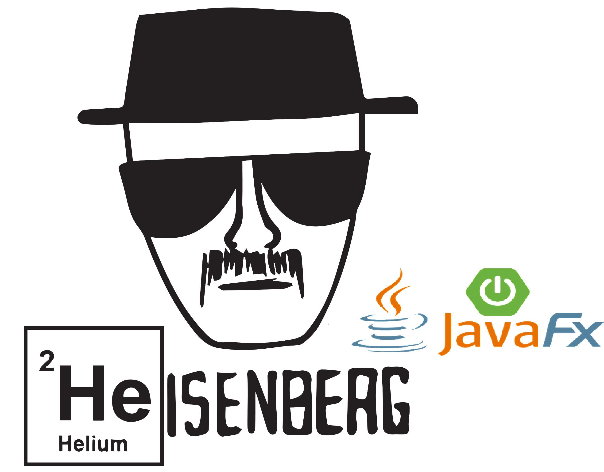

<p align="center">
    
</p>
<p align="center">
    <a href="https://github.com/badges/shields/graphs/contributors" alt="Contributors">
        </a>
    <a href="#backers" alt="Backers on Open Collective">
        </a>
    <a href="#sponsors" alt="Sponsors on Open Collective">
        </a>
    <a href="https://github.com/badges/shields/pulse" alt="Activity">
        </a>
    <a href="https://circleci.com/gh/badges/shields/tree/master">
        </a>
    <a href="https://circleci.com/gh/badges/daily-tests">
        </a>
    <a href="https://coveralls.io/github/badges/shields">
        </a>
    <a href="https://lgtm.com/projects/g/badges/shields/alerts/">
        </a>
    <a href="https://github.com/badges/shields/compare/gh-pages...master">
        </a>
    <a href="https://discord.gg/HjJCwm5">
        </a>
    <a href="https://twitter.com/intent/follow?screen_name=shields_io">
        </a>
</p>


  <h2 align="center">Breaking Bad App</h2>

> Breaking Bad App  is a  GUI  that allows the user to perform calls to the Breaking Bad API and retrieve information like caracters,episodes or quotes. :speak_no_evil:


### :hammer:Built With:wrench:

* [Spring Boot](https://getbootstrap.com)
* [Maven](https://jquery.com)
* [JavaFX]()
* [JSON]()
* [Eclipse]()
* [API Documentation](https://breakingbadapi.com/documentation)

## :checkered_flag:Getting Started:checkered_flag:

This is an example of how you may give instructions on setting up your project locally.
To get a local copy up and running follow these simple example steps.

## Prerequisites:heavy_check_mark:

Before you begin, ensure you have met the following requirements:


* You have installed the latst version of `<coding_language/dependency/requirement_1>` :white_check_mark:
* You have a `<Windows/Linux/Mac>` machine. State which OS is supported/which is not.:white_check_mark:
* You have read `<guide/link/documentation_related_to_project>`.:white_check_mark:

## Installing Breaking Bad App:computer:

OS X & Linux:

```sh
npm install my-crazy-module --save
```

Windows:

```sh
edit autoexec.bat
```

## Using Breaking Bad App:computer:

Use this space to show useful examples of how a project can be used. Additional screenshots, code examples and demos work well in this space. You may also link to more resources.

 please refer to the [Documentation](https://breakingbadapi.com/documentation)

## :clipboard:Release History:clipboard:

* 0.2.1
  
  * CHANGE: Update docs (module code remains unchanged)
* 0.2.0
  * CHANGE: Remove `setDefaultXYZ()`
  * ADD: Add `init()`
* 0.1.1
  
  * FIX: Crash when calling `baz()` (Thanks @GenerousContributorName!)
* 0.1.0
  * The first proper release
  * CHANGE: Rename `foo()` to `bar()`
* 0.0.1
  
  * Work in progress
  
    

## :pencil2:Contributing to Breaking Bad App:pencil2:
To contribute to <project_name>, follow these steps:

1. Fork this repository.
2. Create a branch: `git checkout -b <branch_name>`.
3. Make your changes and commit them: `git commit -m '<commit_message>'`
4. Push to the original branch: `git push origin <project_name>/<location>`
5. Create the pull request.

Alternatively see the GitHub documentation on [creating a pull request](https://help.github.com/en/github/collaborating-with-issues-and-pull-requests/creating-a-pull-request).

## :email:Contact Me :email:

If you want to contact me you can reach me at RicardoVargasLeslie@gmail.com.

## Acknowledgements:open_hands:

* [Breaking Bad API](https://www.breakingbadapi.com/):thumbsup:
* [Tim Biles](@timbiles):thumbsup:
* [Choose an Open Source License](https://choosealicense.com):thumbsup:

## License:scroll:

This project uses the following license: [Apache License 2.0](<link>).